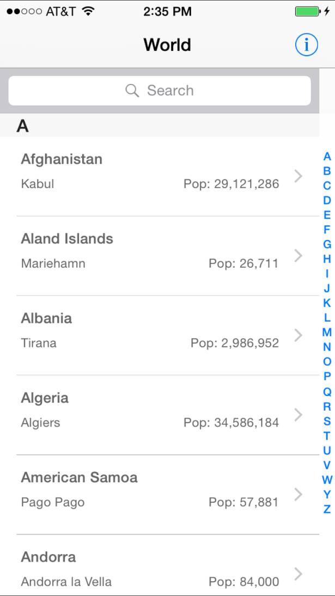
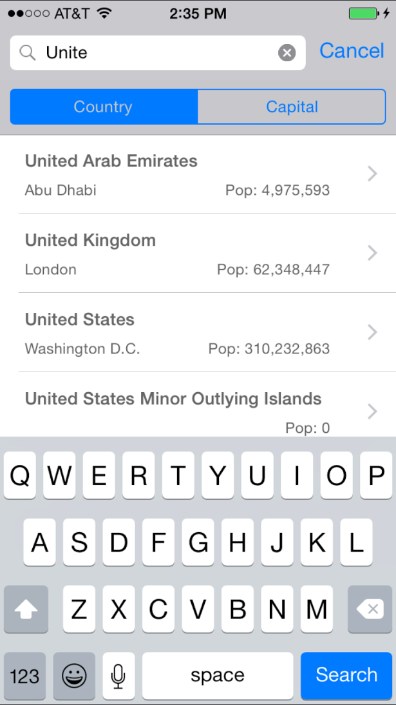
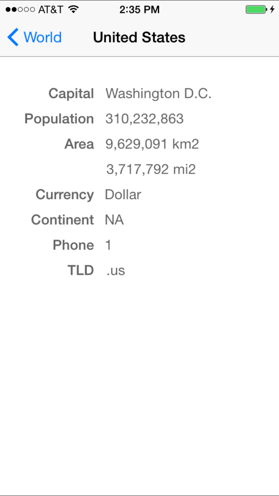

## WorldFactsSQLite
A port of [WorldFacts](https://github.com/kharrison/CodeExamples/tree/master/WorldFacts)  to use SQLite and [FMDB](https://github.com/ccgus/fmdb). The original [WorldFacts](https://github.com/kharrison/CodeExamples/tree/master/WorldFacts) uses [Core Data](https://developer.apple.com/library/mac/documentation/Cocoa/Conceptual/CoreData/cdProgrammingGuide.html).

I converted data from countries.plist to SQL statements and created the
countries.sqlite.

From this app you can learn:

* Read data from [SQLite](http://www.sqlite.org/) with ease using [FMDB](https://github.com/ccgus/fmdb). The database related methods are in  [CountriesDatabase.m](WorldFactsSQLite/CountriesDatabase.m)

* If version number is incremented in the the version table, the database in the document directory will be overwritten. A simple techique to update read only database with new version of app.

* UITableView with dynamic sections and indexes. Look at [MQTCountryTableViewController.m](WorldFactsSQLite/MQTCountryTableViewController.m) at the method viewDidLoad() on how table sections are calculated from dynamic data.

* Filtered search. Look at [MQTCountryTableViewController.m](WorldFactsSQLite/MQTCountryTableViewController.m)

Tested with iOS 7.1 and 8.0

In order to run/play, please open **WorldFactsSQLite.xcworkspace** in xcode (NOT WorldFactsSQLite.xcodeproj, because this project uses [FMDB](https://github.com/ccgus/fmdb) as [CocoaPods](http://cocoapods.org/))

## Schema

    $ sqlite3 countries.sqlite 
    SQLite version 3.7.13 2012-07-17 17:46:21
    Enter ".help" for instructions
    Enter SQL statements terminated with a ";"
    sqlite> .schema
    CREATE TABLE country
    (
        id INTEGER PRIMARY KEY AUTOINCREMENT,
        country_name TEXT UNIQUE,
        capital TEXT,
        area_sqkm INTEGER,
        area_sqmi INTEGER,
        population INTEGER,
        continent TEXT,
        tld TEXT,
        currency TEXT,
        phone TEXT
    );
    CREATE TABLE version
    (
        id INTEGER PRIMARY KEY UNIQUE,
        version_no INTEGER,
        date DATE
    );
    sqlite> select count(*) from country;
    252
    sqlite> select version_no from version;
    9
    sqlite> select * from country order by country_name;
    3|Afghanistan|Kabul|647500|249999|29121286|AS|.af|Afghani|93
    15|Aland Islands|Mariehamn|0|0|26711|EU|.ax|Euro|+358-18
    ..
    249|Zambia|Lusaka|752614|290584|13460305|AF|.zm|Kwacha|260
    250|Zimbabwe|Harare|390580|150802|11651858|AF|.zw|Dollar|263
    
## Screenshots

### Main View

### Search View

### Detail View

## Copyright
MIT

* The Icons are created with [inkscape](http://www.inkscape.org/) from the [AppIconTemplate.svg](http://kodira.de/2013/11/ios-7-app-icon-template-inkscape-svg-editor/). The globe is modified from [openclipart.org](https://openclipart.org/detail/121609/globe-by-jongo_jingaro-121609)
